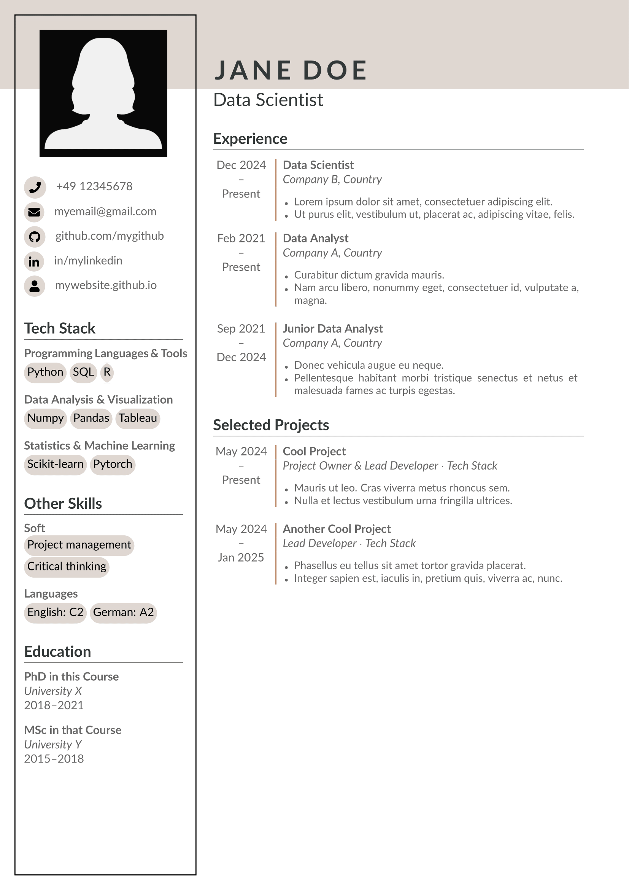

# Modern German LaTeX CV Template

This repository provides a clean, modern **LaTeX version** of a German-style CV/resume template, adapted from an original Word document. The layout follows conventions commonly used in Germany and is fully customizable for personal use.

## ✨ Features

- Based on German CV guidelines  
  _(see: [tech-careers.de – German CV Guide](https://www.tech-careers.de/german-cv-template-how-to-create-a-winning-resume-in-germany/))_
- Minimalist and professional design
- Easy to edit and extend
- Clear section structure: Education, Experience, Skills, etc.
- Ready to compile in Overleaf or locally with LaTeX tools (e.g., VS Code + LaTeX Workshop)

## 📌 Original Source

This LaTeX template was adapted from a Word CV found at:  
🔗 [https://www.tech-careers.de/german-cv-template-how-to-create-a-winning-resume-in-germany/](https://www.tech-careers.de/german-cv-template-how-to-create-a-winning-resume-in-germany/)

## 📸 Preview


[📄 View full PDF](PDF/preview.pdf)

## 📁 Files Included

- `preview.tex` – Main LaTeX source file
- `preview.pdf` – Example output of the compiled CV
- `profilepic.png` – Example profile picture
- `README.md` – This file

## 🛠️ Requirements

To compile the CV, you’ll need a LaTeX environment such as:

- [Overleaf](https://www.overleaf.com/) _(no installation required)_
- TeX Live / MiKTeX / MacTeX
- VS Code with the **LaTeX Workshop** extension

**Recommended compiler:** `pdflatex`

To compile locally, run:

```bash
pdflatex main.tex
```
